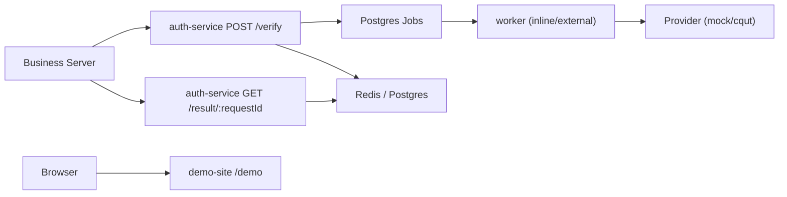

# CQUT Auth

> 通过知行理工帐号认证是否为本校学生，可用于各类服务

详细接口和部署说明见：

- [API 文档](docs/API.md)
- [部署文档](docs/DEPLOYMENT.md)

## 核心流程



## Docker 部署

如果想直接以完整链路运行：

```bash
cd deploy
cp .env.example .env
docker compose --env-file .env up -d --build
```

然后配置 hosts：

```text
127.0.0.1 verify.local
```

访问：

- `http://verify.local/api/health`
- `http://verify.local/demo`

## 生产 HTTPS 部署

仓库额外提供了一套更适合长期使用的生产配置：

- [docker-compose.prod.yml](deploy/docker-compose.prod.yml)
- [site.prod.conf.template](deploy/nginx/site.prod.conf.template)
- [nginx.env.example](deploy/env/nginx.env.example)

建议的公网入口：

- `https://auth.xxx.com/demo`
- `https://auth.xxx.com/api/health`
- `https://auth.xxx.com/api/verify`

使用前准备：

1. 将证书文件放到 `deploy/certs/fullchain.pem` 和 `deploy/certs/privkey.pem`
2. 复制 `deploy/.env.example` 为 `deploy/.env`
3. 在 `deploy/.env` 中填入真实 secret、数据库口令和域名
4. 使用生产 compose 启动

```bash
docker compose --env-file deploy/.env -f deploy/docker-compose.prod.yml up -d --build
```

## 环境变量

### auth-service

| 变量 | 说明 | 默认值 |
| --- | --- | --- |
| `PORT` | 服务端口 | `3001` |
| `APP_ENV` | 环境标识 | - |
| `DEDUPE_KEY_SECRET` | 派生客户端去重标识的密钥 | - |
| `DEMO_CLIENT_ENABLED` | 是否自动注册内置 demo client | 非生产默认 `true`，生产默认 `false` |
| `CLIENT_ID` | 内置 demo client 凭据中的 client id | - |
| `CLIENT_SECRET` | 内置 demo client 凭据中的 client secret | - |
| `AUTH_PROVIDER` | 上游认证提供方，支持 `mock` 或 `cqut` | - |
| `WORKER_MODE` | worker 运行模式，支持 `inline` 或 `external` | 开发环境 `inline`，生产环境 `external` |
| `WORKER_INLINE_ENABLED` | 仅在 `inline` 模式生效；控制 auth-service 是否自动启动内联 worker | - |
| `WORKER_HEARTBEAT_INTERVAL_MS` | external worker 写入健康心跳的间隔 | `5000` |
| `WORKER_HEARTBEAT_STALE_MS` | 判定 external worker 心跳过期的阈值 | `15000` |
| `REDIS_URL` | Redis 连接串 | - |
| `DATABASE_URL` | PostgreSQL 连接串 | - |
| `VERIFY_RATE_LIMIT_ENABLED` | 是否启用按 `client_id` 限流 | - |
| `VERIFY_RATE_LIMIT_MAX` | 窗口内最大请求数 | - |
| `VERIFY_RATE_LIMIT_WINDOW_SECONDS` | 限流窗口秒数 | - |
| `JOB_PAYLOAD_SECRET` | 队列中凭据的加密密钥 | - |
| `CORS_ALLOWED_ORIGINS` | 允许跨域访问 auth-service 的 Origin 列表，逗号分隔 | 默认禁用跨域 |
| `TRUST_PROXY_HOPS` | 反向代理 hop 数 | 开发默认 `0`，生产默认 `1` |
| `WORKER_CONCURRENCY` | worker 并发数 | - |
| `JOB_MAX_ATTEMPTS` | 任务最大重试次数 | - |
| `JOB_RETRY_BASE_MS` | 重试退避基数 | - |
| `PROVIDER_TIMEOUT_MS` | 单次上游请求超时 | - |
| `PROVIDER_TOTAL_TIMEOUT_MS` | 整条 provider 流程超时 | - |
| `STARTUP_STRICT_DEPENDENCIES` | 是否强制要求当前运行模式所需依赖可用 | - |

### demo-site

| 变量 | 说明 | 默认值 |
| --- | --- | --- |
| `PORT` | demo 服务端口 | `3002` |
| `AUTH_SERVICE_BASE_URL` | 认证服务地址 | - |
| `DEMO_CLIENT_ENABLED` | 是否允许 demo-site 使用服务端 demo client 凭据 | 非生产默认 `true`，生产必须显式开启 |
| `CLIENT_ID` | demo-site 调用 auth-service 时使用的 client id | - |
| `CLIENT_SECRET` | demo-site 调用 auth-service 时使用的 client secret | - |

示例见：

- [auth-service.env.example](/Users/uednd/code/CQUT-Auth/deploy/env/auth-service.env.example)
- [demo-site.env.example](/Users/uednd/code/CQUT-Auth/deploy/env/demo-site.env.example)
- [deploy/.env.example](/Users/uednd/code/CQUT-Auth/deploy/.env.example)

## 本地开发

前置条件：

- Node.js 20+
- `pnpm`
- `inline` 模式下，Redis / PostgreSQL 可选
- `external` 模式下，需要 PostgreSQL；如启用 Redis 限流并配置 `REDIS_URL`，则还需要 Redis

安装依赖：

```bash
pnpm install
```

常用命令：

```bash
# 生成 deploy/.env（若已存在则拒绝覆盖）
pnpm generate:env

# 仅启动 auth-service
pnpm dev

# 同上，显式写法
pnpm dev:auth

# 启动独立 worker（要求 DATABASE_URL 可用）
pnpm dev:worker

# 启动示例站点
pnpm dev:demo

# 全仓构建
pnpm build

# 运行全仓测试
pnpm test

# 运行全仓类型检查
pnpm lint
```

默认端口：

- auth-service: `3001`
- demo-site: `3002`

本地访问：

- 认证服务就绪检查：`http://localhost:3001/health/ready`
- demo 页面：`http://localhost:3002/demo`

默认运行模式：

- `pnpm dev` / `pnpm dev:auth`：`WORKER_MODE=inline`
- `pnpm dev:worker`：固定使用 `WORKER_MODE=external`
- `inline` 内存队列只在单进程里可见，不能与独立 `auth-worker` 混用

健康检查语义：

- `GET /health/live` 仅表示进程存活，固定返回 `200`
- `GET /health/ready` 在依赖未满足时返回 `503`

## API 概览

auth-service 对外提供：

- `POST /api/verify`
- `GET /api/result/:requestId`
- `GET /api/health/live`
- `GET /api/health/ready`

demo-site 对外提供：

- `GET /demo`
- `POST /demo/api/verify`
- `GET /demo/api/result/:requestId`
