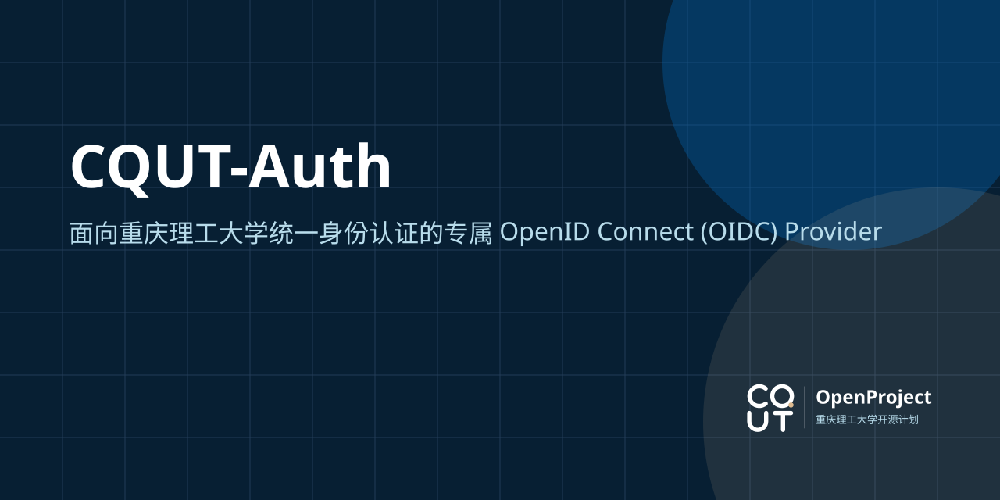

<div align="center">
  <a href="LICENSE"></a>
  <a href="https://nodejs.org/"></a>
  <a href="https://pnpm.io/"></a>
  <a href="https://cqut-openproject.github.io/CQUT-Auth/"></a>
</div>

> [!NOTE]
> CQUT-Auth 是为受控客户端提供登录服务的 OpenID Connect Provider，通过重庆理工大学 UIS / CAS 验证学校账号并将验证结果关联到本地 Subject，再通过 Authorization Code + PKCE 向已审核的客户端签发令牌。
>
> **完整文档**：[CQUT-Auth 文档站](https://cqut-openproject.github.io/CQUT-Auth/)

> [!CAUTION]
> 程序会在登录期间接收学校账号和密码，并将其用于请求 UIS。
>
> 凭据不会写入数据库，但仍需自行完成安全评审、日志审计、网络隔离、密钥管理和隐私合规等审计工作。请勿将未经审计的实例直接用于生产环境。忽略此警告而造成的任何后果与本项目无关。

## 主要能力

- **「统一接入」**：基于标准 OIDC 协议，接入方一次对接即可获得完整登录能力，无需处理 UIS / CAS 等繁琐流程
- **「身份可信」**：复用学校 UIS / CAS 系统校验票据并关联在校身份，确保账号为真实在校学生
- **「管理便捷」**：提供客户端管理后台，可管理项目成员与客户端，配置 Redirect URI、Scope 与 Client Secret，并处理审核、邮箱验证与运行策略

## 使用 AI 创建与管理客户端

将以下内容发送给你的 Agent：

```text
我需要为项目对接 OAuth 平台，访问 https://your-domain.com/api/agent 并按照其指示协助我完成客户端创建工作。
```

更多步骤与说明见[《Agent API》](https://cqut-openproject.github.io/CQUT-Auth/guide/agent-api)

## 快速体验

本地功能测试（非生产配置）：

```bash
pnpm install
pnpm init-env --profile test
pnpm docker:up
```

管理后台：`http://127.0.0.1:3003/manage`  
停止服务：`pnpm docker:down`

更多步骤与说明见[《本地启动》](https://cqut-openproject.github.io/CQUT-Auth/guide/getting-started)

## 文档

| 章节      | 链接                                                                           |
| --------- | ------------------------------------------------------------------------------ |
| 项目介绍  | [指南](https://cqut-openproject.github.io/CQUT-Auth/guide/introduction)        |
| 本地启动  | [快速开始](https://cqut-openproject.github.io/CQUT-Auth/guide/getting-started) |
| OIDC 接入 | [端点与流程](https://cqut-openproject.github.io/CQUT-Auth/oidc/overview)       |
| 生产部署  | [部署](https://cqut-openproject.github.io/CQUT-Auth/deploy/production)         |
| 配置说明  | [环境变量](https://cqut-openproject.github.io/CQUT-Auth/deploy/configuration)  |
| 开发      | [开发指南](https://cqut-openproject.github.io/CQUT-Auth/guide/development)     |
| 安全      | [安全说明](https://cqut-openproject.github.io/CQUT-Auth/guide/security)        |

## 切换到旧版

旧版系统位于 `legacy` 分支，不包含客户端管理功能，目前已停止维护。

## 许可证

本项目基于 [MIT](./LICENSE) 协议开源。
